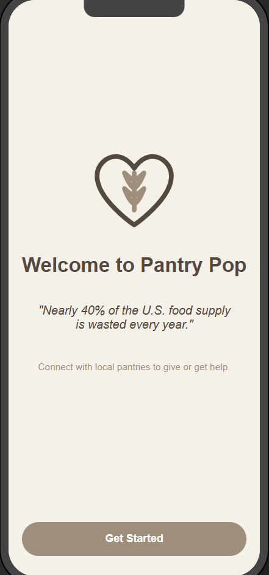
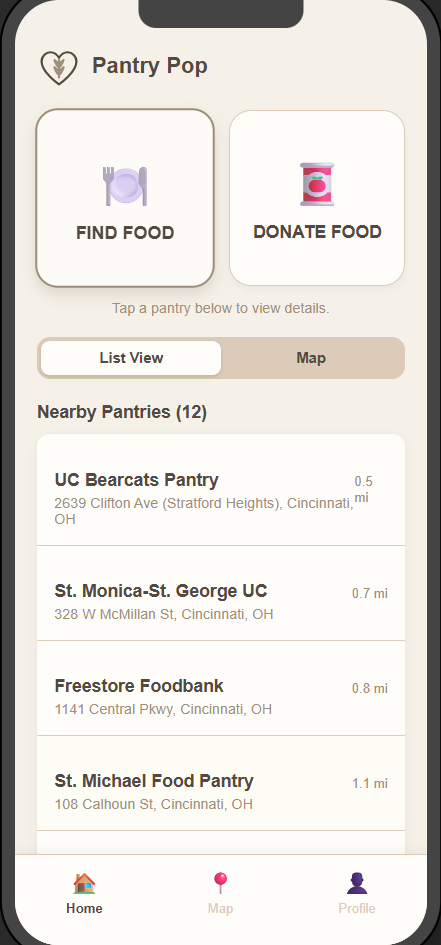
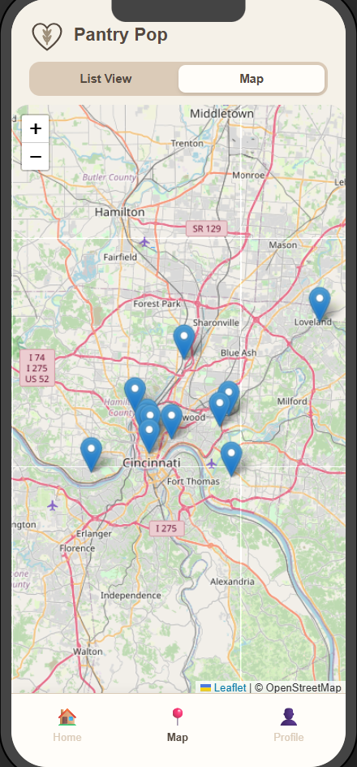
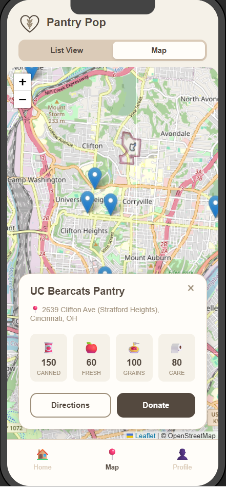
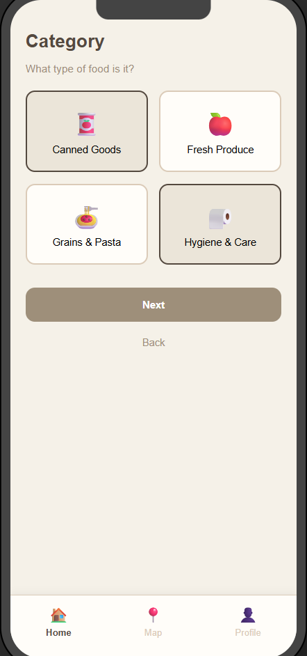
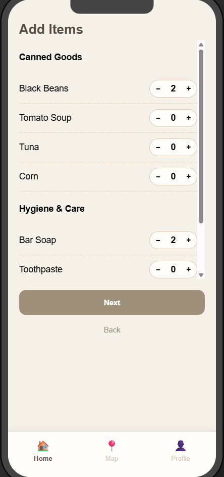
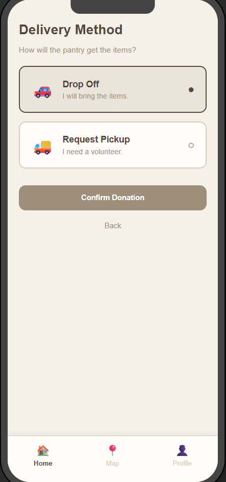
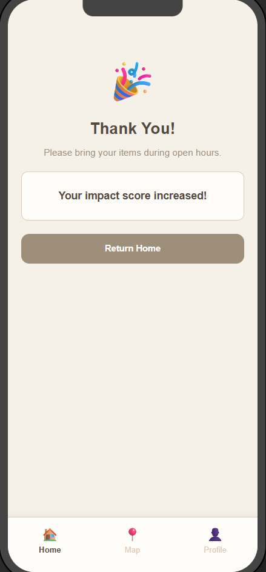
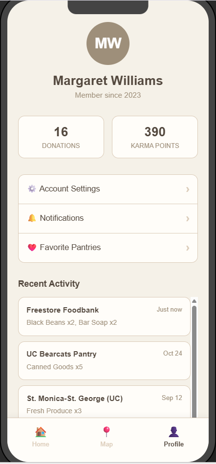

<div align="center">
  
  <h1>PantryPop</h1>
  <p>
    <strong>Connect. Locate. Support.</strong><br>
    A modern way to find local food pantries and check real-time inventory.
  </p>

  <a href="https://svelte.dev">
    
  </a>
  <a href="https://vitejs.dev">
    
  </a>
  <a href="https://leafletjs.com">
    
  </a>
</div>

<br />

## 📖 About The Project

**Pantry Pop** is a mobile-first web application designed to bridge the gap between food pantries and the community. It allows users to visually locate pantries on an interactive map, view current stock levels (fresh produce, grains, canned goods), and easily navigate to or donate to specific locations.

### ✨ Key Features

* **📍 Interactive Map:** visualize pantry locations using Leaflet & OpenStreetMap.
* **🍎 Live Inventory:** Check stock levels for Canned Goods, Fresh Produce, Grains, and Care items before you go.
* **🚗 One-Click Directions:** Integrated Google Maps support for instant navigation.
* **❤️ Easy Donations:** Seamless flow to support local pantries financially.
* **📱 Responsive Design:** Optimized for mobile usage with a clean, toggleable List/Map view.

---

## 📸 Try Here: https://pantryp0p.netlify.app/ 


---

## 📸 Screenshots

| Welcome | Find Food | Map View |
|:---:|:---:|:---:|
|  |  |  |

| Pantry Stats | Donation Flow | Donation Flow |
|:---:|:---:|:---:|
|  |  |  |

| Delivery options | Confirmation | Profile |
|:---:|:---:|:---:|
|  |  |  |

---

## 🛠️ Tech Stack

* **Framework:** [Svelte](https://svelte.dev/)
* **Build Tool:** [Vite](https://vitejs.dev/)
* **Maps:** [Leaflet.js](https://leafletjs.com/) (OpenStreetMap)
* **State Management:** Svelte Stores
* **Styling:** CSS Variables (Theming: Espresso, Cream, Sage, Terracotta)

---

## 🚀 Getting Started

Follow these steps to run the project locally on your machine.

### Prerequisites
* Node.js (v16 or higher)
* npm

### Installation

1.  **Clone the repository**
    ```bash
    git clone https://github.com/margihingrajia/UI-for-Good
    cd UI-for-Good
    ```

2.  **Install dependencies**
    ```bash
    npm install
    ```

3.  **Run the development server**
    ```bash
    npm run dev
    ```

4.  **Open in browser**
    Click the link shown in the terminal (usually `http://localhost:5173`).

---


## 📂 Project Structure

```text
public/
├── logo.svg             # Application Icon
src/
├── assets/              # Static assets
├── lib/
│   ├── components/      # Reusable UI elements (BottomNav, Cards, Logo)
│   ├── data.js          # Mock data for pantries and inventory
│   ├── Home.svelte      # Main List View Screen
│   ├── Map.svelte       # Map View Screen with Leaflet
│   ├── Donation.svelte  # Donation Flow Screen
│   ├── Profile.svelte   # User Profile Screen
│   └── PantryDetails.svelte # Detailed view component
├── stores.js            # Global state (Navigation, Selected Pantry)
├── App.svelte           # Main Application Layout
└── main.js              # Entry point
